# Spend-Tracking-App
Spend Tracking application with a bunch of features. 

Users of this application can bring people together in a group that spent money on a shared event. It can be people living together or friends on a vacation that want to keep track of expenses and analyze expenses later on to split the total amount.

Login and register pages.   
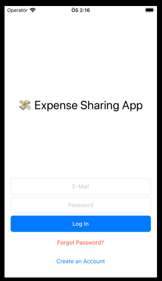
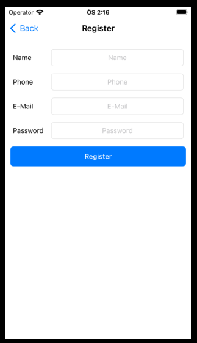  

Group list and create group page. There is a joining procedure in group enrolling.   
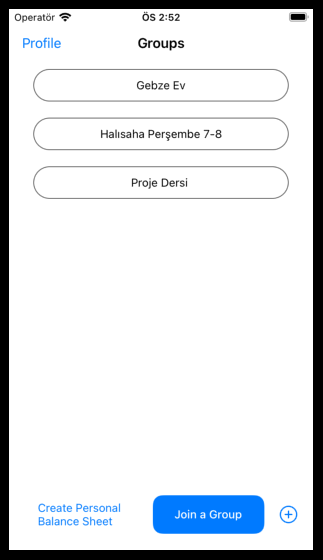
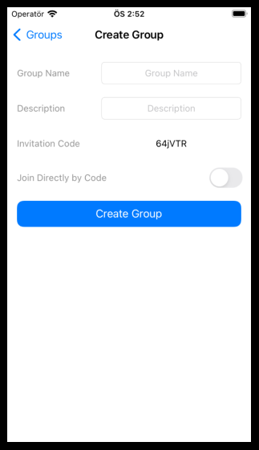  

Expenses entered in group lay in this page.   
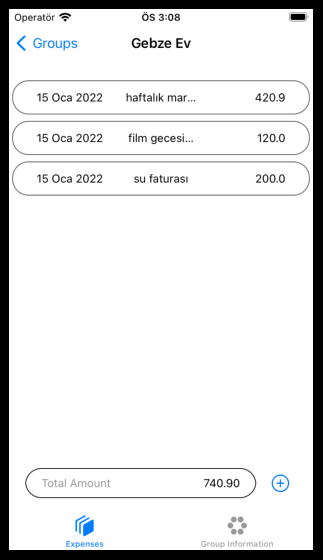  

Creating and viewing an expense pages.   
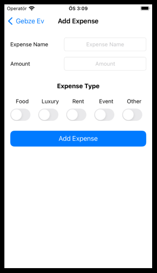
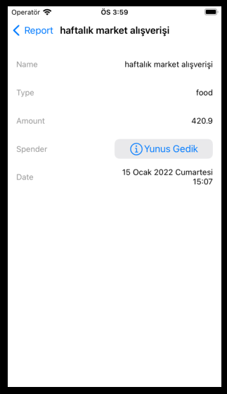  

Group information and administration page. View join requests page. Only group admin can view requests.   
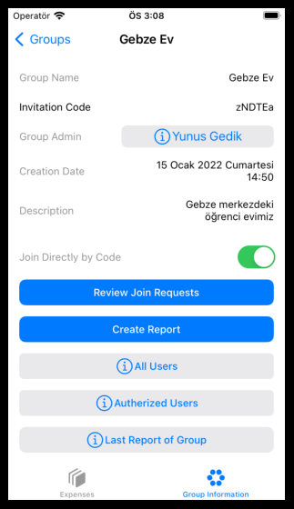
  

All users, autherized users page.   
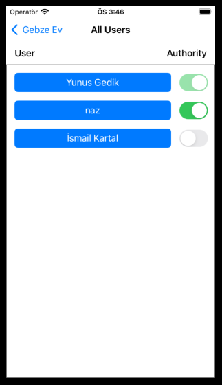
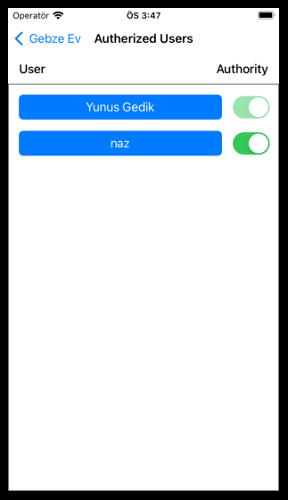  

Group report page.   
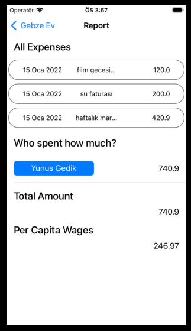
